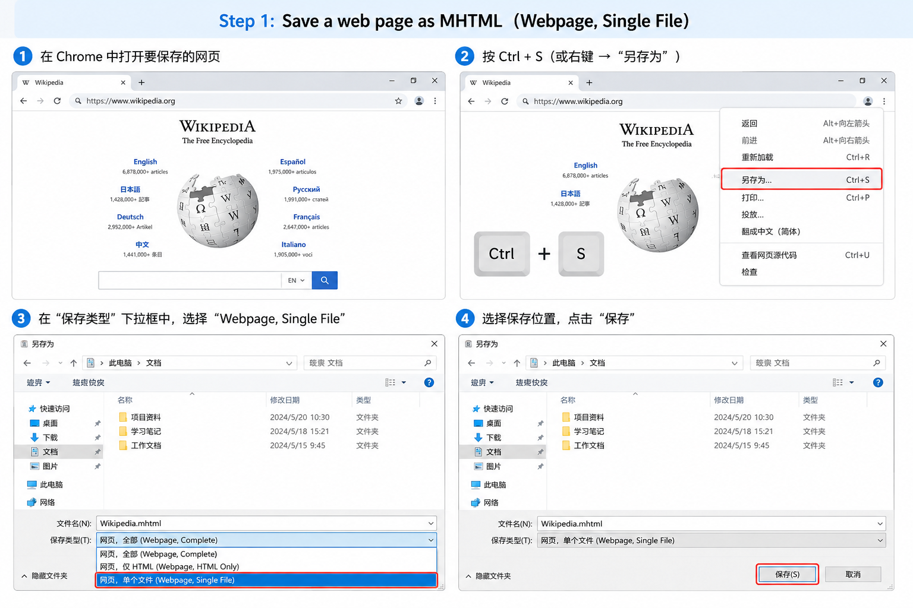
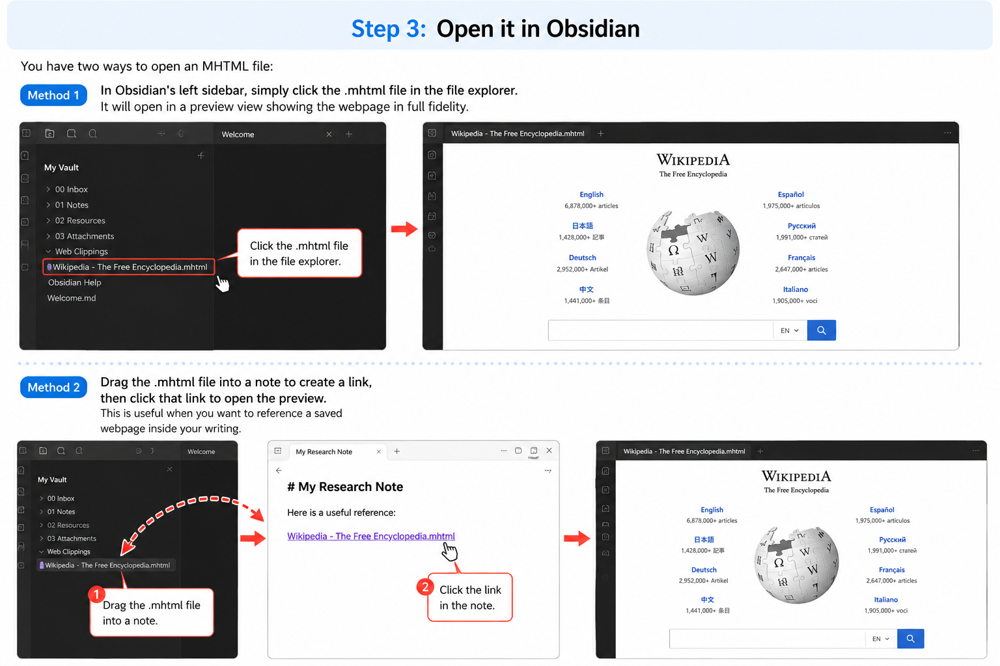

# MHTML Preview for Obsidian

Preview `.mhtml` (MIME HTML) files directly in Obsidian with full fidelity — images, CSS, fonts, and layout preserved.

## Features

- **Full visual fidelity** — CSS stylesheets are inlined as `<style>` tags, images and fonts as data URIs
- **Inline embed preview** — `` shows a live preview inside notes, in both Reading and Live Preview mode
- **Drag & drop** — drag an `.mhtml` file into a note, auto-embeds as inline preview
- **Sandboxed rendering** — content is displayed in a sandboxed iframe for security isolation
- **Zero dependencies** — custom RFC 2557 MHTML parser, no runtime npm packages needed
- **Cross-platform** — works on Windows, macOS, and Linux

## Installation

### Quick Install (download & copy)

Copy three files into your vault's plugin folder:

```
{your-vault}\.obsidian\plugins\mhtml-preview\
├── main.js
├── manifest.json
└── styles.css
```

You can get the files from the [Releases page](https://github.com/Ydong2010/obsidian-mhtml-preview/releases), or directly from this repository.

Then:
1. Open Obsidian → Settings → Community Plugins
2. If "Safe mode" is on, turn it off
3. Find "MHTML Preview" in the list and toggle it **On**

### Build from Source (for developers)

```bash
git clone https://github.com/Ydong2010/obsidian-mhtml-preview.git
cd obsidian-mhtml-preview
npm install
npm run build
```

Then copy the three files as described above.

## How to Use

This plugin lets you preview web pages that you've saved as MHTML files. Here's how, step by step:

### Step 1: Save a web page as MHTML

Open the page you want to save in **Chrome** or **Edge**, then:

- Press **Ctrl + S** (or right-click → "Save as")
- In the "Save as type" dropdown, choose **"Webpage, Single File"** (not "Webpage, Complete" — that creates a folder)
- Choose a location and click Save



> **Note**: If you're using another browser (Firefox, Safari, etc.), this format may not be available. Chrome and Edge work best.

### Step 2: Put the file in your vault

Move or copy the saved `.mhtml` file into any folder inside your Obsidian vault. You can put it in the root folder or any subfolder — it's up to you.

### Step 3: Open it in Obsidian

You have three ways to preview an MHTML file:

**Method 1 (click)** — In Obsidian's left sidebar, click the `.mhtml` file in the file explorer. Opens in a full tab.

**Method 2 (drag & drop)** — **Drag the `.mhtml` file into a note**. An inline preview embed will appear automatically in both Reading view and Live Preview.

**Method 3 (manual embed)** — Write the embed syntax: ``. This shows an inline preview directly inside the note.

> **Tip**: If you drag a file and it shows as a plain link, use `Ctrl+P` → "Convert MHTML link to embed" to turn it into an inline preview.



### Context menu options

Click the **"…"** (More options) button in the top-right corner of the preview tab to access:

- **Refresh preview** — reload the MHTML file (useful if you've updated it externally)
- **Copy file path** — copy the file's location within your vault

### Supported file types

| Extension | Source |
|---|---|
| `.mhtml` | Chrome / Edge default save format |
| `.mht` | Alternate extension (same format) |

## How It Works

MHTML (RFC 2557) bundles an entire web page — HTML, CSS, images, fonts, and scripts — into a single file using `multipart/related` MIME encoding. Chromium-based browsers (Chrome, Edge) can save pages in this format, but they **block MHTML from loading in iframes** as a security measure.

This plugin works around that restriction by:

1. **Parsing** the MHTML file client-side into its constituent MIME parts
2. **Decoding** each part's content (handling base64, quoted-printable, and binary encodings)
3. **Inlining** all resources — CSS becomes `<style>` tags, images become `data:` URIs
4. **Rendering** the self-contained HTML in a sandboxed iframe via `srcdoc`

### Encodings Supported

| Transfer Encoding | Status |
|---|---|
| `base64` | ✅ Full support |
| `quoted-printable` | ✅ Full support |
| `7bit` / `8bit` / `binary` | ✅ Full support |

### Resource Matching

The plugin uses a multi-strategy URL resolution to match HTML references to MIME parts:

1. Exact normalized URL match
2. Filename-only match
3. Path without query string/hash
4. With/without leading slash variants
5. Case-insensitive filename match
6. Path segment tail match (last 2 segments)
7. `cid:` URI references

## Settings

| Setting | Default | Description |
|---|---|---|
| **Iframe sandbox** | `allow-scripts allow-same-origin` | Controls iframe security restrictions |
| **Dark mode filter** | Off | Apply a CSS invert filter in dark mode |

## Limitations

- **External resources** — URLs pointing to external CDNs (not saved in the MHTML) will not load. Chrome's "Save as" typically includes all resources, but dynamically loaded content may be missing
- **JavaScript** — Scripts execute in the sandboxed iframe, but features requiring network access (AJAX, WebSockets) will fail
- **Forms** — Form submissions will not work as there is no server to handle them
- **Very large files** — Files over 50MB may be slow to parse due to the Latin-1 decoding step

## Development

```bash
# Install dependencies
npm install

# Watch mode (auto-rebuild on changes)
npm run dev

# Production build
npm run build
```

### Project Structure

```
src/
├── main.ts           # Plugin entry point
├── view.ts            # FileView subclass with iframe rendering
├── mhtml-parser.ts    # RFC 2557 MHTML parser
└── html-inliner.ts    # DOM-based resource inliner
```

### Tech Stack

- TypeScript
- esbuild (bundling)
- Obsidian Plugin API (FileView, vault.readBinary)
- Browser APIs (DOMParser, TextDecoder, atob/btoa)

## License

MIT

## Credits

Built with the [Obsidian Plugin API](https://docs.obsidian.md/).
